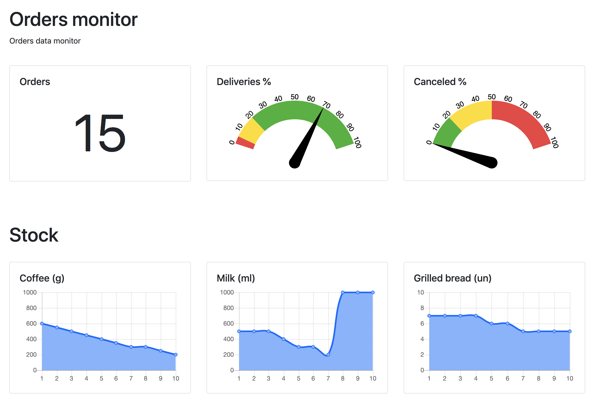

# Sample Coffee Bar - Event / Reactive System

## Modules

- `vagrant`: Vagrant environment with Ansible provisioner to provide an environment with Kafka and MySQL; 
- `coffee-model`: Model project to reuse data POJOs between projects;
- `coffee-store`: Vert.x App Store project to generate orders and control it's statuses;
- `coffee-stock`: Vert.x App Stock project to control the product stock items;
- `coffee-machine`: Vert.x App Machine project to simulate the machine running;
- `coffee-monitor`: Vert.x with Angular App Monitor project to have an overview of the system running;

## Valid States of Order

 - `placed`: Order is pre validated;
 - `confirmed`: The order has enough ingredients available;
 - `delivered`: The order has finished it's preparation process;
 - `canceled`: The order has been canceled due to out of stock items.

## Event Streams / State transitions / Kafka Topics

 - `test-order-submitted`: User interaction event to submit orders;
 - `test-order-placed`: After the order has been pre validated the other is accepted by the system;
 - `test-order-confirmed`: After the order has been validated against required stock products;
 - `test-order-preparation`-started: After the order has started the preparation process;
 - `test-order-preparation`-finished: After the order has finished from the preparation process;
 - `test-order-canceled`: After the order has been canceled due to out of stock products.

## Running the modules

- Download Kafka from https://kafka.apache.org/ and place it under the `[BASE_DIR]/event-streams/vagrant/roles/kafka/files`
    
    ---
    **NOTE**
    
    This script is expecting to have the following version: `kafka_2.12-2.2.0.tgz`
    
    ---
- `vagrant`: `$ vagrant up`
- `coffee-stock`: `$ mvn exec:java -pl coffee-stock`
- `coffee-machine`: `$ mvn exec:java -pl coffee-machine`
- `coffee-store`: `$ mvn exec:java -pl coffee-store`
- `coffee-monitor`: `$ mvn exec:java -pl coffee-monitor`
 
## Monitor Dashboard

 - After successfully executed open the dashboard at: http://localhost:8080
 
